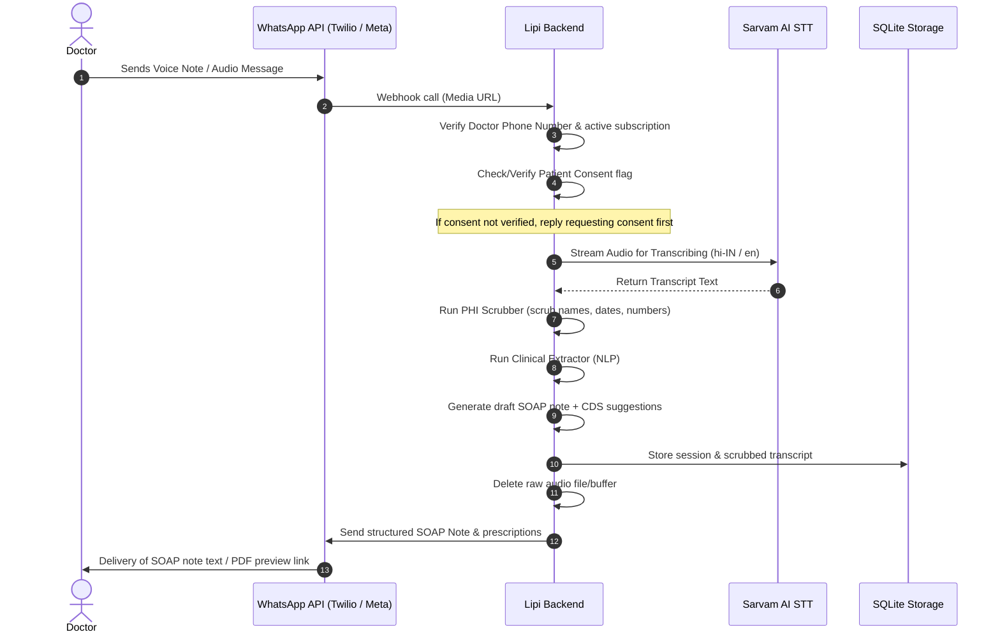

# WhatsApp Integration Beta Plan (Lipi)

This document outlines the architecture, data privacy flow, and implementation plan for introducing a WhatsApp-based audio dictation and clinical drafting flow for Lipi.

---

## 1. Objectives

- Allow busy physicians to send WhatsApp voice notes directly to Lipi.
- Receive draft SOAP notes and prescriptions back via WhatsApp message.
- Maintain Lipi's non-negotiable security, consent, and privacy guarantees.

---

## 2. Architecture & Message Flow

---

## 3. Privacy & Safety Controls

1. **Explicit Consent Gate**: Since WhatsApp does not have a native "checkbox" UI, the physician must send a command (e.g., `#consent [Patient Initials/ID]`) or reply to a consent prompt *before* sending the audio recording. Without this, processing is blocked.
2. **Strict Retention Policy**: 
   - No audio files are saved locally on the Lipi backend. Media URLs fetched from the WhatsApp/Twilio servers are processed in-memory or in temporary, short-lived files, and unlinked immediately.
   - Any raw text transcripts containing names/numbers are scrubbed by the local PHI scrubber before being stored in the database.
3. **Safety Disclaimer**: Every message returned containing clinical output must append the safety label: `"doctor_review_required: Doctor is the final authority. Review clinical details before copy/paste."`
4. **No Auto-Prescribing**: The system will never take actions or trigger prescriptions automatically.

---

## 4. Phase-wise Implementation Plan

### Phase 1: Sandbox & Mock Webhook (2 Weeks)
- Set up Meta developer account and WhatsApp Business Sandbox.
- Build the incoming message webhook receiver (`POST /api/whatsapp/webhook`).
- Mock the voice note processing.

### Phase 2: Core Processing & Integration (3 Weeks)
- Integrate with WhatsApp media download API.
- Connect media streams directly to Sarvam ASR.
- Implement the `#consent` text pre-requisite check.

### Phase 3: Pilot Rollout (2 Weeks)
- Launch beta test with Dr. Sawhney and 2 other doctors.
- Monitor WER and failure rates.
- Fine-tune Hinglish vocabulary mapping.
